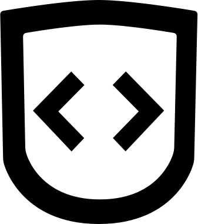

# Full Stack Adventure!

My learning roadmap, 2020 - and beyond!

## Roadmaps

Taken from @kamranahmedse's [roadmap.sh](https://roadmap.sh). Scribbled on by me.

Shield logo by me. 

### Front End

### Back End

### DevOps

## Things to learn

- [ ] GraphQL
- [ ] Docker / Docker Compose / Kubernetes
- [ ] Node / Express
- [ ] JWT Auth login, etc.
- [ ] Local Storage
- [ ] Users, Database managment
- [ ] Networking 101
