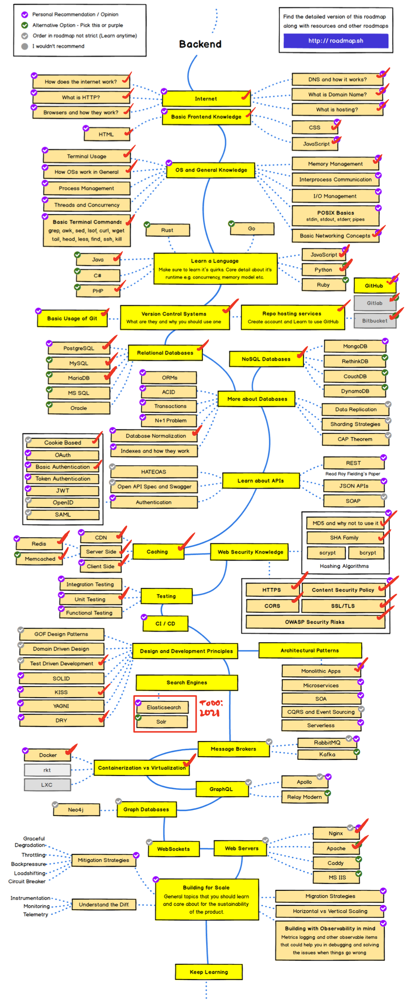
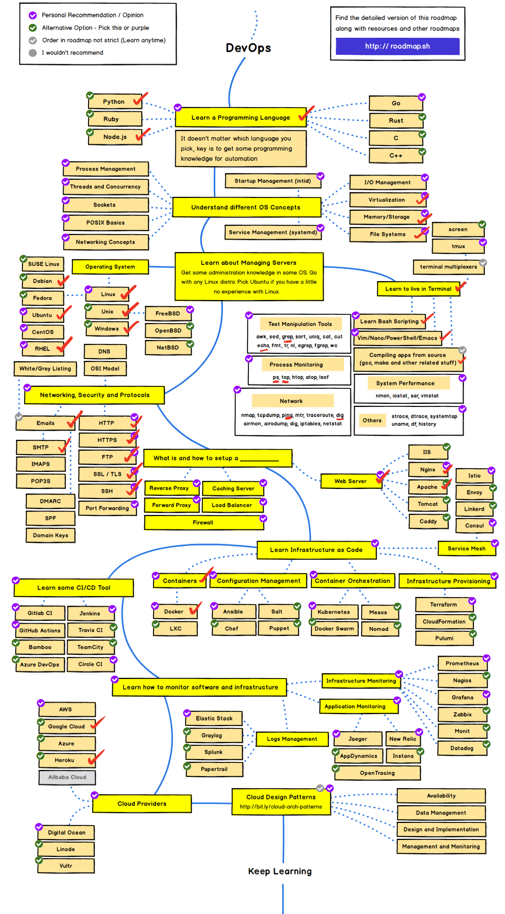

# Full Stack Adventure!

  

I started a **Master of Information Technology** in March, 2020. I find it hard to visualise what I know, where I've been, where I'm going next. So I finally got around to scribbling on these road maps and making a big todo list. A work in progress, forever, until I die!

Download your roadmaps from [roadmap.sh](https://roadmap.sh), fork this repo and forge ahead with me, if you dare.

## Work in progress

- [x] Node / Express
- [x] Docker / Docker Compose
- [x] Local Storage
- [x] Users, Database managment
- [ ] Processing and p5.js
- [ ] GraphQL
- [ ] Kubernetes
- [ ] JWT Auth login, etc.
- [ ] Networking 101

## Roadmaps

Taken from @kamranahmedse's [roadmap.sh](https://roadmap.sh). Scribbled on by me.

## + 10 INT, +3 STR

## Credits

- _[Road maps](https://roadmap.sh) by @kamranahmedse_
- _Shield logo by me, @miclgael._
- _Backpack icon by Alana._
